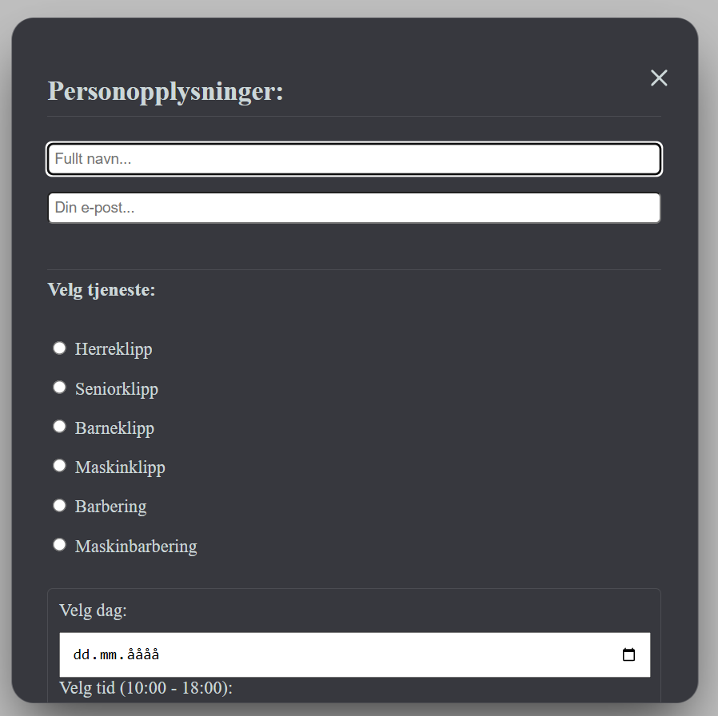

<div>
<h1 align= "center">Booking System - Fordypning & Oppdrag</h1>
</div>

<div>

</div>


## 📌 Om prosjektet

Dette prosjektet er en fullstack booking-nettside som er en del av **https://github.com/darisomericic/Barbershop_ProsjektVG2** og lar brukere se tilgjengelige tjenester og bestille timer direkte gjennom applikasjonen.

Nettsiden sammenligner tilgjengelighet på valgte datoer, og lagrer alle bestillinger sikkert i en database med automatisk e-postbekreftelse.

Prosjektet er laget som en del av et skoleprosjekt for å demonstrere forståelse av **frontend, backend, database og e-postintegrasjon**.

---


## ✨ Funksjoner

### Hva nettsiden viser/gjør

Applikasjonen inneholder følgende funksjonalitet:

* Brukergrensesnitt for booking av timer
* Valg av tjeneste, dato og tidspunkt
* Automatisk validering av e-postadresse
* Sjekk av tilgjengelige tidspunkter
* Booking-modal/skjema
* Lagring av all bestillingsinformasjon i database
* Automatisk e-postbekreftelse til kunden
* Feilbehandling for doble bestillinger

---

## ⚙️ Teknologier

### Hvordan nettsidens teknologi fungerer

### Frontend:

* Dynamisk brukergrensesnitt bygget i `React` med `Vite` som build-tool

* UI og responsivitet implementeres med `CSS` og komponentbiblioteker som `Radix UI`

### Backend

* Booking-logikk, validering og e-postfunksjonalitet håndteres med `Flask`, et backend-rammeverk for `Python`

* E-post-intigrasjon via `Flask-Mail` med Gmail SMTP

### Database

* Alle bestillinger og kundedata lagres sikkert i `MySQL` ved hjelp av `mysql-connector-python`

---

## ❓Hvorfor brukte jeg disse teknologier

### Hvorfor brukte jeg **React** 

- Hadde den som interessegruppe på skolen, og fikk mye ut ifra den

- Veldig bra for dynamiske nettsider, som denne

- Gir bedre oversikt over filer, og gir bedre mappestruktur enn bare HTML/CSS

---

### Hvorfor brukte jeg både **POST** og **GET** som metoder 

- Brukte POST for å sende ut data og GET for å hente inn data

- Har nylig hatt forelesning om disse metoder, så ville prøve hvordan de fungerer

- Ville lære meg hvordan begge fungerer og hva de gjør for nettsiden

---

### Hvorfor brukte jeg ikke **.env** for å gjøre sensitiv informasjon skjult

- Oppgaven er fordypning, som betyr å utdype meg i det jeg ikke kan 

- Jeg var bevisst på at jeg lot informasjon som kunne vært sensitiv ligge åpen.

- Oppgaven er en lokal demo uten viktig informasjon som kan ramme meg, eller noen andre 


### Hvorfor har jeg mange kommentarer i koden 

- For oversikt over hva koden er, og hva den gjør

- For teknisk informasjon er avgjørende for vedlikehold og videreutvikling av nettsiden

- Lærere og arbeidsgivere liker å se kommentarer i koden, og det viser forståelse


## 📋 Booking informasjon

Når en bruker bestiller en time lagres følgende informasjon:

* Navn
* E-postadresse
* Valgt tjeneste
* Dato
* Tidspunkt
* Opprettelsesdatapunkt (automatisk)

Denne informasjonen sendes fra `React` frontend til `Flask` backend, som validerer dataen og lagrer den i `MySQL`-databasen. Kunden mottar umiddelbar e-postbekreftelse.

---

## 🗄️ Database struktur

Eksempel på hvordan database-tabellen ser ut:

### Bestillinger

| id | navn          | epost                    | tjeneste      | dato       | tid   | opprettet           |
| -- | ------------- | ----------------------- | ------------- | ---------- | ----- | ------------------- |
| 1  | Ola Nordmann  | ola@example.com          | Service A     | 2024-05-15 | 10:00 | 2024-05-10 14:30:00 |
| 2  | Kari Andersen | kari@example.com         | Service B     | 2024-05-15 | 14:00 | 2024-05-10 15:45:00 |

---

## 🧱 Prosjektstruktur

```
Fordypning_Utvikling/
|── venv/                      # Virtuelt Python-miljø
│   ├── Include/
│   ├── Lib/
│   ├── Scripts/
│   └── pyvenv.cfg
|
├── mitt-prosjekt/             # Frontend (React)
│   ├── src/                   # Kildekode 
│   │   ├── assets/            # Bilder og ressurser
│   │   ├── App.jsx            # Main app-komponent
│   │   ├── main.jsx           # Entry point
│   │   ├── App.css            # Stil
│   │   └── index.css          # Globale stiler
│   │
│   ├── public/                # Statiske filer
│   ├── index.html             # HTML-template
│   ├── package.json           # Frontend-avhengigheter
│   ├── vite.config.js         # Vite-konfigur
│   └── eslint.config.js       # ESLint-regler
|
├── app.py                     # Backend (Flask)
├── db.sql                     # Database-skjema
├── package.json               # Root-avhengigheter
└── README.md                  # Dokumentasjon
```

---

## 🚀 Hvordan kjøre prosjektet

### 1. Klon repo

```
git clone <repo-url>
cd Fordypning_Utvikling
```

### 2. Sett opp Python-miljø

```
python -m venv venv
venv\Scripts\activate  # Windows
# eller
source venv/bin/activate  # Mac/Linux
```

### 3. Installer backend-avhengigheter

```
pip install flask flask-cors mysql-connector-python flask-mail
```

### 4. Konfigurer database

* Opprett en MySQL-database kalt `Fordypning_Demo`
* Kjør SQL-scriptene fra `db.sql`:
```
mysql -u root -p Fordypning_Demo < db.sql
```
* Oppdater databasekredensialene i `app.py` hvis nødvendig

### 5. Start backend

```
python app.py
```
Backend kjører på `http://localhost:5000`

### 6. Start frontend

I en ny terminal:

```
cd mitt-prosjekt
npm install
npm run dev
```
Frontend kjører på `http://localhost:5173`

---

## Tilgjengelige Skript

### Frontend (i `mitt-prosjekt`-mappen)

### `npm run dev`
Kjører appen i development modus med hot-reload.
Åpne http://localhost:5173 for å se nettsiden i nettleseren.

Siden oppdaterer seg automatisk når du gjør endringer.

----

### `npm run build`
Bygger appen for produksjon til `dist`-mappen. 
Koden blir minifisert og optimalisert for beste ytelse.

----

### `npm run lint`
Kjører ESLint for å sjekke kodekvalitet og finne mulige feil.

----

### `npm run preview`
Forhåndsviser produksjonsbygget lokalt.

---

## 🎯 Mål med prosjektet

Målet med prosjektet her er å lære:

* Hvordan bygge en fullstack web-applikasjon
* Hvordan kommunisere mellom frontend og backend via API
* Hvordan validere og sikre brukerdata
* Hvordan lagre data persistente i en relasjonsdatabase
* Hvordan integrere e-postfunksjonalitet
* Hvordan håndtere feil og edge-cases
* Best practices for backend og frontend-utvikling

---
